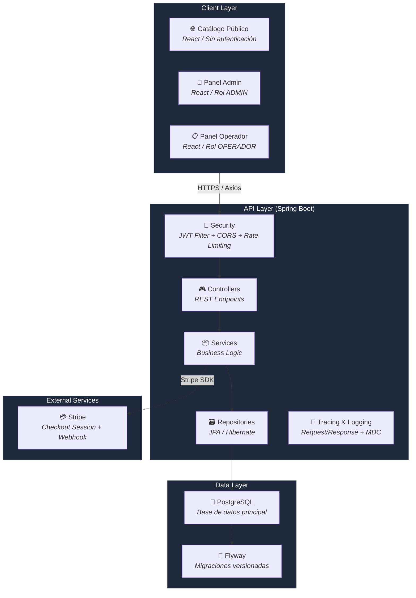

<p align="center">
  
</p>

<p align="center">
  
</p>

<h1 align="center">📦 InvenCore</h1>
<h3 align="center">Sistema de Gestión de Inventario Empresarial</h3>

<br>

## 🚀 Acceso rápido

| Recurso | Enlace |
|---------|--------|
| 🌐 Frontend | [https://inven-core-alpha.vercel.app](https://inven-core-alpha.vercel.app) |
| ⚙ Backend API | [https://invencore.onrender.com](https://invencore.onrender.com) |
| 📚 Swagger | [https://invencore.onrender.com/swagger-ui/index.html](https://invencore.onrender.com/swagger-ui/index.html) |
| 💻 Repositorio | [https://github.com/LuisAIDev/-InvenCore](https://github.com/LuisAIDev/-InvenCore) |

<p align="center">
  Sistema full-stack de inventario empresarial con arquitectura en capas, autenticación JWT, catálogo público, módulo de ofertas, checkout con pagos reales en modo sandbox (Stripe), y paneles diferenciados por rol.
</p>

<br>

<p align="center">
  
  
  
  
  
  
  
  
  
  
  
  
  
</p>

<br>

---

## 🚀 Demo del Proyecto

<div align="center">
  <table>
    <tr>
      <td align="center" width="250">
        <a href="https://inven-core-alpha.vercel.app" target="_blank">
          
          <br>
          <strong>inven-core-alpha.vercel.app</strong>
        </a>
      </td>
      <td align="center" width="250">
        <a href="https://invencore.onrender.com" target="_blank">
          
          <br>
          <strong>invencore.onrender.com</strong>
        </a>
      </td>
      <td align="center" width="250">
        <a href="https://invencore.onrender.com/swagger-ui/index.html" target="_blank">
          
          <br>
          <strong>Swagger UI</strong>
        </a>
      </td>
      <td align="center" width="250">
        <a href="https://github.com/LuisAIDev/-InvenCore" target="_blank">
          
          <br>
          <strong>LuisAIDev/InvenCore</strong>
        </a>
      </td>
    </tr>
  </table>
</div>

> **💡 Las credenciales de acceso (admin/operador) se comparten directamente con reclutadores y evaluadores.** Escríbeme por [LinkedIn](https://www.linkedin.com/in/luisorlandoguerra/) o [GitHub](https://github.com/LuisAIDev) para acceder a la demo en vivo.

---

## 📊 Estado del Proyecto

<div align="center">

| Estado | Detalle |
|---|---|
| ✅ Proyecto activo | En desarrollo continuo con mejoras constantes |
| ✅ CI/CD funcionando | GitHub Actions — Backend (Maven + tests) + Frontend (Vite build) |
| ✅ Frontend desplegado | [Vercel](https://inven-core-alpha.vercel.app) — Automático desde `main` |
| ✅ Backend desplegado | [Render](https://invencore.onrender.com) — Automático desde `main` |
| ✅ API documentada | [Swagger UI](https://invencore.onrender.com/swagger-ui/index.html) — OpenAPI 3.0 |
| ✅ Integración Stripe | Checkout Session + Webhook (modo sandbox) |
| ✅ Seguridad JWT | Autenticación stateless con expiración configurable |
| ✅ Flyway Migrations | Versionado de esquema de base de datos |
| ✅ Pruebas automatizadas | JUnit 5 + Mockito + MockMvc + H2 |

</div>

---

## 📈 Métricas del Proyecto

<div align="center">

| | | | |
|---|---|---|---|
| 📦 **+20 REST Endpoints** | 🔐 **JWT Authentication** | 💳 **Stripe Checkout** | ⚙ **Spring Boot 3** |
| ⚛ **React 18** | 🗄 **PostgreSQL** | 📚 **Swagger OpenAPI** | 🧪 **JUnit + Mockito** |
| 🚀 **Render** | ▲ **Vercel** | ⚡ **GitHub Actions** | 🛡 **Role Based Access** |

</div>

---

## 📋 Contenido

- [Arquitectura](#-arquitectura)
- [Tecnologías](#-tecnologías)
- [Funcionalidades](#-funcionalidades)
- [Capturas del Proyecto](#-capturas-del-proyecto)
- [Instalación Local](#-instalación-local)
- [Variables de Entorno](#-variables-de-entorno)
- [API — Endpoints Principales](#-api--endpoints-principales)
- [Seguridad](#-seguridad)
- [CI/CD](#-cicd)
- [Roadmap](#-roadmap)
- [Autor](#-autor)
- [Licencia](#-licencia)

---

## 🏗️ Arquitectura



### Backend — arquitectura en capas clásica

```
Controller → Service → Repository → Entity
```

- Separación estricta de responsabilidades por capa
- DTOs para todas las entradas/salidas de la API (nunca se exponen entidades JPA directamente)
- Migraciones de base de datos versionadas con Flyway
- Manejo centralizado de excepciones (GlobalExceptionHandler) con respuestas de error consistentes
- Logging estructurado con trazabilidad por request (TracingFilter)
- Rate limiting con Bucket4j (protección contra fuerza bruta en login y abuso de API)

### Frontend — SPA en React

Enrutamiento protegido por rol, estado de carrito persistente vía Context API + localStorage, y consumo de API vía Axios.

### Modelo de datos clave

```
Producto ──< OfertaProducto >── Oferta
Producto ──< PedidoItem >── Pedido ──1:1── Pago
Usuario   ──< Movimiento >── Producto
```

---

## 🛠️ Tecnologías

### Frontend

| Logo | Tecnología | Detalle |
|---|---|---|
|  | React | 18 |
|  | Vite | 8.x |
|  | Tailwind CSS | 3.4 |
| | lucide-react | Íconos |
| | Axios | HTTP client |
| | React Router DOM | 6.x |
|  | JavaScript | ES2023 |

### Backend

| Logo | Tecnología | Detalle |
|---|---|---|
|  | Java | 17 LTS |
|  | Spring Boot | 3.2.5 |
| | Spring Security + JWT | Autenticación stateless |
| | Hibernate / JPA | 6.4.4 |
| | Bucket4j | Rate limiting |

### Database

| Logo | Tecnología | Detalle |
|---|---|---|
|  | PostgreSQL | 17 |
|  | Flyway | Versionado de esquema |

### Payments

| Tecnología | Detalle |
|---|---|
| Stripe Java SDK | Modo sandbox |

### DevOps

| Logo | Tecnología | Detalle |
|---|---|---|
|  | GitHub Actions | CI/CD pipelines |
|  | Docker | Preparado para contenedores |
| | Render | Hosting backend (despliegue automático desde main) |
| | Vercel | Hosting frontend (despliegue automático desde main) |

### Testing

| Tecnología | Detalle |
|---|---|
| JUnit 5 + Mockito + MockMvc + H2 | Suite obligatoria en CI |

### Documentation

| Logo | Tecnología | Detalle |
|---|---|---|
|  | Springdoc / Swagger UI | OpenAPI 3.0 |

---

## ✨ Funcionalidades

### 📦 Catálogo y gestión de productos

| | Feature |
|---|---|
| ✅ | CRUD completo de productos, con imágenes, categorías y control de stock |
| ✅ | Catálogo público (`/catalogo`) accesible sin necesidad de cuenta, con paginación y oculta el stock exacto a visitantes |
| ✅ | Filtro automático de productos agotados en el catálogo público |
| ✅ | Alertas de stock bajo y stock mínimo configurable por producto |

### 🏷️ Ofertas y promociones

| | Feature |
|---|---|
| ✅ | Módulo de ofertas vinculadas a productos existentes (sin duplicar catálogo) |
| ✅ | Descuentos con fecha de inicio/fin, aplicados automáticamente en el catálogo público (precio tachado + badge de descuento) |

### 🛒 Pedidos y pagos

| | Feature |
|---|---|
| ✅ | Carrito de compras persistente (agregar, editar cantidad, eliminar, vaciar) |
| ✅ | Checkout completo integrado con Stripe (modo sandbox — sin procesamiento de pagos reales) |
| ✅ | Precio congelado al momento de la compra (con descuentos de ofertas activas aplicados) |
| ✅ | El stock se descuenta únicamente al confirmarse el pago, no al crear el pedido |
| ✅ | Panel administrativo de pedidos con estado de pago en tiempo real |

### 📋 Movimientos e inventario

| | Feature |
|---|---|
| ✅ | Registro de entradas y salidas de stock con trazabilidad completa (usuario, fecha, motivo) |
| ✅ | Historial paginado y filtrable |
| ✅ | Dashboard con métricas: productos activos, alertas de stock bajo, movimientos del día |

### 🔐 Roles y seguridad de acceso

| | Feature |
|---|---|
| ✅ | Autenticación JWT sin estado (stateless) |
| ✅ | Dos paneles diferenciados por rol: **Administrador** (control total: productos, categorías, ofertas, pedidos, usuarios) y **Operador** (panel operativo enfocado en consulta de stock y registro de movimientos, con vista previa de stock antes de confirmar una salida) |
| ✅ | Creación de usuarios exclusivamente por un administrador desde el panel (sin registro público autoservicio, por diseño de seguridad) |
| ✅ | Activar/desactivar usuarios (soft delete) con invalidación inmediata de sesión activa |

### 🎨 Diseño e interfaz

| | Feature |
|---|---|
| ✅ | Interfaz completamente responsive (móvil, tablet, escritorio) |
| ✅ | Paneles admin y operador con identidad visual propia |
| ✅ | Documentación interactiva de la API vía Swagger UI, accesible públicamente |

---

## 📸 Capturas del Proyecto

### 🔐 Login

<p align="center">
  
</p>

---

### 📊 Dashboard

<p align="center">
  
</p>

---

### 👥 Gestión de Usuarios

<p align="center">
  
</p>

---

### 📦 Inventario

<p align="center">
  
</p>

---

### 💳 Checkout Stripe

<p align="center">
  
</p>

---

### 📚 Swagger UI

<p align="center">
  
</p>

---

## 🚀 Instalación Local

### Requisitos previos

- ☕ **Java 17+**
- 📦 **Maven 3.9+**
- 🐘 **PostgreSQL 17**
- ⚛ **Node.js 18+**
- 📁 **Git**

### 1. Clonar el repositorio

```bash
git clone https://github.com/LuisAIDev/-InvenCore.git
cd InvenCore
```

### 2. Configurar la base de datos

```sql
CREATE DATABASE invencore_db;
```

### 3. Configurar variables de entorno

Crea `backend/src/main/resources/application-dev.properties` (o usa variables de entorno del sistema):

```properties
PGHOST=localhost
PGPORT=5432
PGDATABASE=invencore_db
PGUSER=tu_usuario
PGPASSWORD=tu_password

JWT_SECRET=tu_clave_secreta_base64
JWT_EXPIRATION=86400000

STRIPE_SECRET_KEY=sk_test_tu_clave
STRIPE_PUBLISHABLE_KEY=pk_test_tu_clave
STRIPE_WEBHOOK_SECRET=whsec_tu_clave

CORS_ALLOWED_ORIGINS=http://localhost:5173
```

> **⚠️ La aplicación usa configuración fail-fast: no arrancará si falta alguna variable requerida. Esto es intencional — evita despliegues silenciosamente mal configurados.**

### 4. Ejecutar el backend

```bash
cd backend
mvn spring-boot:run
```

- 🌐 Servidor en `http://localhost:8080`
- 📚 Swagger UI en `http://localhost:8080/swagger-ui/index.html`

### 5. Ejecutar el frontend

```bash
cd frontend
npm install
npm run dev
```

- 🌐 Aplicación en `http://localhost:5173`

---

## 🔧 Variables de Entorno

### Backend (`application.properties` o variables de sistema)

| Variable | Descripción | Obligatoria |
|---|---|---|
| `PGHOST` | Host de PostgreSQL | ✅ |
| `PGPORT` | Puerto de PostgreSQL | ✅ |
| `PGDATABASE` | Nombre de la base de datos | ✅ |
| `PGUSER` | Usuario de base de datos | ✅ |
| `PGPASSWORD` | Contraseña de base de datos | ✅ |
| `JWT_SECRET` | Clave secreta para JWT (256+ bits, base64) | ✅ |
| `JWT_EXPIRATION` | Tiempo de expiración JWT en milisegundos | ✅ |
| `STRIPE_SECRET_KEY` | Clave secreta de Stripe (sk_test_) | ✅ |
| `STRIPE_PUBLISHABLE_KEY` | Clave publicable de Stripe (pk_test_) | ✅ |
| `STRIPE_WEBHOOK_SECRET` | Secreto del webhook de Stripe (whsec_) | ✅ |
| `CORS_ALLOWED_ORIGINS` | Orígenes permitidos para CORS (separados por coma) | ❌ (default: `http://localhost:5173`) |

### Frontend (variables de entorno de Vite)

| Variable | Descripción | Obligatoria |
|---|---|---|
| `VITE_API_URL` | URL base de la API backend | ❌ (default: `http://localhost:8080/api`) |
| `VITE_STRIPE_PUBLISHABLE_KEY` | Clave publicable de Stripe para el frontend | ✅ |

---

## 📡 API — Endpoints Principales

La documentación completa e interactiva está disponible en [Swagger UI](https://invencore.onrender.com/swagger-ui/index.html).

### 🔑 Autenticación

```http
POST /api/auth/login
Content-Type: application/json

{
  "email": "admin@invencore.com",
  "password": "********"
}
```

```http
POST /api/auth/registro
Content-Type: application/json
Authorization: Bearer <token-admin>

{
  "nombre": "Nuevo Usuario",
  "email": "usuario@invencore.com",
  "password": "********",
  "rol": "OPERADOR"
}
```

### 📦 Productos

```http
GET /api/productos?page=0&size=10
Authorization: Bearer <token>
```

```http
POST /api/productos
Content-Type: application/json
Authorization: Bearer <token-admin>

{
  "nombre": "Laptop Gamer",
  "precio": 4500000,
  "stock": 10,
  "stockMinimo": 3,
  "categoriaId": 1,
  "imagenUrl": "https://i.imgur.com/ejemplo.jpg"
}
```

```http
PUT /api/productos/{id}
Content-Type: application/json
Authorization: Bearer <token-admin>
```

```http
DELETE /api/productos/{id}
Authorization: Bearer <token-admin>
```

### 👥 Usuarios

```http
GET /api/usuarios
Authorization: Bearer <token-admin>
```

```http
PATCH /api/usuarios/{id}/estado
Authorization: Bearer <token-admin>
```

### 🌐 Endpoints públicos

```http
GET /api/publico/productos?page=0&size=12
```

```http
GET /api/publico/categorias
```

```http
POST /api/publico/pedidos
Content-Type: application/json

{
  "items": [
    { "productoId": 1, "cantidad": 2 }
  ],
  "successUrl": "https://inven-core-alpha.vercel.app/confirmacion?session_id={CHECKOUT_SESSION_ID}",
  "cancelUrl": "https://inven-core-alpha.vercel.app/catalogo"
}
```

### 🔐 Endpoints protegidos (admin/operador)

| Método | Endpoint | Descripción | Auth |
|---|---|---|---|
| GET | `/api/productos` | Listar productos | JWT |
| POST | `/api/productos` | Crear producto | ADMIN |
| PUT | `/api/productos/{id}` | Editar producto | ADMIN |
| DELETE | `/api/productos/{id}` | Eliminar producto | ADMIN |
| GET | `/api/categorias` | Listar categorías con conteo de productos | JWT |
| GET | `/api/ofertas` | Listar ofertas | JWT |
| POST | `/api/ofertas` | Crear oferta | ADMIN |
| GET | `/api/admin/pedidos` | Listar pedidos | ADMIN |
| GET | `/api/movimientos` | Historial de stock | JWT |
| POST | `/api/movimientos` | Registrar movimiento | JWT |
| GET | `/api/usuarios` | Listar usuarios | ADMIN |
| PATCH | `/api/usuarios/{id}/estado` | Activar/desactivar usuario | ADMIN |

### 🌍 Endpoints públicos

| Método | Endpoint | Descripción | Auth |
|---|---|---|---|
| POST | `/api/auth/login` | Iniciar sesión | Público |
| GET | `/api/publico/productos` | Catálogo público paginado | Público |
| GET | `/api/publico/categorias` | Categorías públicas | Público |
| POST | `/api/publico/pedidos` | Crear pedido (checkout) | Público |
| POST | `/api/publico/pedidos/{id}/confirmar-pago` | Confirmar pago con Stripe | Público |
| GET | `/api/health` | Health check | Público |

---

## 🔒 Seguridad

<div align="center">

| Capa | Implementación |
|---|---|
| **🛂 JWT** | Autenticación con expiración configurable y `JwtAuthenticationEntryPoint` propio (401 correcto en vez de errores genéricos) |
| **🛡 Spring Security** | Cadena de filtros con `JwtAuthFilter`, `RateLimitingFilter` y `CorsFilter` |
| **🔑 Password Encryption** | BCrypt — contraseñas nunca almacenadas ni logueadas en texto plano |
| **👤 Role Based Access** | Dos roles con paneles diferenciados: `ADMIN` (control total) y `OPERADOR` (inventario y movimientos) |
| **🚫 Disabled Users Protection** | Soft delete con invalidación inmediata de sesión activa |
| **✅ Input Validation** | Validación con `@Valid` y `GlobalExceptionHandler` para 15 tipos de excepción con formato `ApiErrorResponse` consistente |
| **⏱ Rate Limiting** | Bucket4j: login (5 req/min), general (100 req/min) |
| **🔐 Secrets Management** | Variables de entorno con fail-fast — la app no arranca si falta configuración crítica |
| **🌐 CORS** | Configurado globalmente vía `CORS_ALLOWED_ORIGINS`, sin hardcodear orígenes por controlador |
| **📖 Swagger Exposure** | Documentación expuesta fuera de la cadena de autenticación mediante `securityMatchers`, sin comprometer el resto de la API |
| **🧹 Git Audit** | Historial limpiado de credenciales expuestas con BFG Repo-Cleaner |

</div>

---

## ⚙️ CI/CD

### Flujo de despliegue

```
👨‍💻 Desarrollador
      │
      ▼
🐙 GitHub (Push a main)
      │
      ▼
⚡ GitHub Actions
      │
      ├── 🔧 Backend CI ──┬── Maven Compile
      │                   ├── 🧪 Tests (JUnit + Mockito + MockMvc + H2)
      │                   └── ✅ Green
      │
      └── 🎨 Frontend CI ──┬── npm install
                          ├── Vite Build
                          └── ✅ Green
      │
      ▼ (Solo si ambos pipelines pasan)
      │
      ├── 🚀 Render → Backend desplegado automáticamente
      │
      └── ▲ Vercel → Frontend desplegado automáticamente
```

Cada push a `main` dispara automáticamente:

- **Backend CI** — compilación con Maven, suite completa de tests (JUnit + Mockito + MockMvc contra H2)
- **Frontend CI** — instalación de dependencias y build de producción con Vite

Solo tras pasar **ambos pipelines en verde** se considera un cambio listo para producción. El backend se despliega automáticamente en [Render](https://invencore.onrender.com) y el frontend en [Vercel](https://inven-core-alpha.vercel.app), ambos vía integración directa con GitHub.

---

## 🗺️ Roadmap

### ✅ Completado

- [x] CRUD completo de productos, categorías y movimientos
- [x] Autenticación JWT + roles ADMIN/OPERADOR
- [x] Dashboard administrativo + panel de operador con identidad visual propia
- [x] Catálogo público con imágenes y filtrado de productos agotados
- [x] Módulo de ofertas y promociones
- [x] Módulo de pedidos y checkout con pagos vía Stripe (sandbox)
- [x] Documentación interactiva de API con Swagger
- [x] CI/CD completo con GitHub Actions
- [x] Suite de tests unitarios e integración (JUnit 5 + Mockito + H2)
- [x] Diseño responsive (móvil, tablet, escritorio)
- [x] Rate limiting y hardening de seguridad de autenticación
- [x] Gestión de usuarios restringida a administradores (sin autoregistro público)

### 🔄 En progreso / próximos pasos

- [ ] Refresh tokens
- [ ] Reportes exportables (PDF / CSV / Excel)
- [ ] Gráficas de tendencia de movimientos por período
- [ ] Filtros avanzados en Productos y Movimientos
- [ ] Dockerización completa del entorno de desarrollo

---

## 👨‍💻 Autor

<div align="center">
  <table>
    <tr>
      <td align="center" width="600">
        <h2>Luis Orlando Guerra González</h2>
        <h3>🚀 Software Developer</h3>
        <p><em>Desarrollador Full-Stack | Cartagena, Colombia 🇨🇴</em></p>
        <br>
        <p>
          Especializado en desarrollo de aplicaciones empresariales con <strong>Java Spring Boot</strong> y <strong>React</strong>.
          Apasionado por la arquitectura limpia, la seguridad de aplicaciones y la mejora continua.
        </p>
        <br>
        <p align="center">
          <a href="https://github.com/LuisAIDev">
            
          </a>
          <a href="https://www.linkedin.com/in/luisorlandoguerra/">
            
          </a>
          <a href="mailto:luis@invencore.com">
            
          </a>
        </p>
      </td>
    </tr>
  </table>
</div>

---

## 📄 Licencia

Este proyecto está bajo la **Licencia MIT**. Libre para usar como referencia o aprendizaje.

```
MIT License

Copyright (c) 2024 Luis Orlando Guerra González

Permission is hereby granted, free of charge, to any person obtaining a copy
of this software and associated documentation files (the "Software"), to deal
in the Software without restriction, including without limitation the rights
to use, copy, modify, merge, publish, distribute, sublicense, and/or sell
copies of the Software, and to permit persons to whom the Software is
furnished to do so, subject to the following conditions:
...
```

---

<div align="center">

**¿Te parece útil este proyecto?** ⭐ [Dale una estrella en GitHub](https://github.com/LuisAIDev/-InvenCore) — significa mucho para un desarrollador independiente.

Construido con dedicación por **Luis Orlando Guerra González** — Cartagena, Colombia 🇨🇴

</div>
