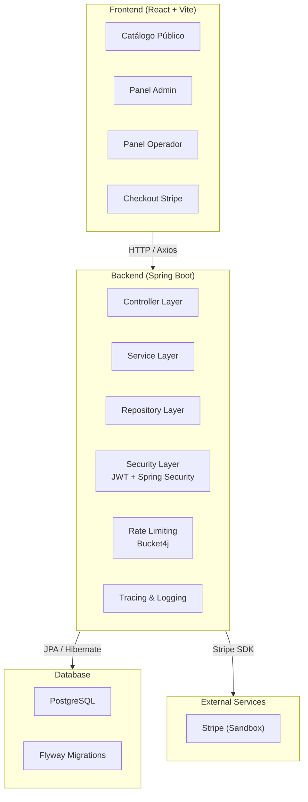

<p align="center">
  
</p>

<div align="center">

# 📦 InvenCore

**Sistema de Gestión de Inventario Empresarial**

[](https://openjdk.org/)
[](https://spring.io/projects/spring-boot)
[](https://reactjs.org/)
[](https://vitejs.dev/)
[](https://www.postgresql.org/)
[](https://jwt.io/)
[](https://stripe.com/)
[](https://swagger.io/)
[](https://flywaydb.org/)
[](https://www.docker.com/)
[](https://github.com/features/actions)
[](https://render.com/)
[](https://vercel.com/)
[](LICENSE)

Sistema full-stack de inventario empresarial con arquitectura en capas, autenticación JWT, catálogo público, módulo de ofertas, checkout con pagos reales en modo sandbox (Stripe), y paneles diferenciados por rol.

[🌐 Ver demo en vivo](https://invencore.vercel.app/) · [📖 Documentación de la API (Swagger)](https://invencore-api.onrender.com/swagger-ui/index.html) · [🐛 Reportar bug](https://github.com/LuisAIDev/-InvenCore/issues) · [✨ Sugerir mejora](https://github.com/LuisAIDev/-InvenCore/issues)

</div>

<br>

<div align="center">

📦 **+20 REST Endpoints** &nbsp;·&nbsp; 🔐 **JWT Authentication** &nbsp;·&nbsp; 💳 **Stripe Payments** &nbsp;·&nbsp; 📊 **Swagger Documentation** &nbsp;·&nbsp; 🧪 **Automated Testing** &nbsp;·&nbsp; ⚙️ **GitHub Actions CI/CD** &nbsp;·&nbsp; 🚀 **Backend Render** &nbsp;·&nbsp; 🌐 **Frontend Vercel** &nbsp;·&nbsp; 🗄 **PostgreSQL** &nbsp;·&nbsp; 🛡 **Role Based Access** &nbsp;·&nbsp; 📄 **Flyway Migrations**

</div>

<br>

---

## 📋 Contenido

- [Características](#-características)
- [Arquitectura](#-arquitectura)
- [Tecnologías](#-tecnologías)
- [Capturas del Proyecto](#-capturas-del-proyecto)
- [Instalación Local](#-instalación-local)
- [API — Endpoints Principales](#-api--endpoints-principales)
- [Seguridad](#-seguridad)
- [CI/CD](#-cicd)
- [Roadmap](#-roadmap)
- [Autor](#-autor)
- [Licencia](#-licencia)

---

## ✨ Características

### ✅ Catálogo y gestión de productos

- [x] CRUD completo de productos, con imágenes, categorías y control de stock
- [x] Catálogo público (`/catalogo`) accesible sin necesidad de cuenta, con paginación y oculta el stock exacto a visitantes
- [x] Filtro automático de productos agotados en el catálogo público
- [x] Alertas de stock bajo y stock mínimo configurable por producto

### ✅ Ofertas y promociones

- [x] Módulo de ofertas vinculadas a productos existentes (sin duplicar catálogo)
- [x] Descuentos con fecha de inicio/fin, aplicados automáticamente en el catálogo público (precio tachado + badge de descuento)

### ✅ Pedidos y pagos

- [x] Carrito de compras persistente (agregar, editar cantidad, eliminar, vaciar)
- [x] Checkout completo integrado con Stripe (modo sandbox — sin procesamiento de pagos reales)
- [x] Precio congelado al momento de la compra (con descuentos de ofertas activas aplicados)
- [x] El stock se descuenta únicamente al confirmarse el pago, no al crear el pedido
- [x] Panel administrativo de pedidos con estado de pago en tiempo real

### ✅ Movimientos e inventario

- [x] Registro de entradas y salidas de stock con trazabilidad completa (usuario, fecha, motivo)
- [x] Historial paginado y filtrable
- [x] Dashboard con métricas: productos activos, alertas de stock bajo, movimientos del día

### ✅ Roles y seguridad de acceso

- [x] Autenticación JWT sin estado (stateless)
- [x] Dos paneles diferenciados por rol:
  - **Administrador** — control total: productos, categorías, ofertas, pedidos, usuarios
  - **Operador** — panel operativo enfocado en consulta de stock y registro de movimientos, con vista previa de stock antes de confirmar una salida
- [x] Creación de usuarios exclusivamente por un administrador desde el panel (sin registro público autoservicio, por diseño de seguridad)
- [x] Activar/desactivar usuarios (soft delete) con invalidación inmediata de sesión activa

### ✅ Diseño e interfaz

- [x] Interfaz completamente responsive (móvil, tablet, escritorio)
- [x] Paneles admin y operador con identidad visual propia
- [x] Documentación interactiva de la API vía Swagger UI, accesible públicamente

---

## 🏗️ Arquitectura



Backend — arquitectura en capas clásica:

```
Controller → Service → Repository → Entity
```

- Separación estricta de responsabilidades por capa
- DTOs para todas las entradas/salidas de la API (nunca se exponen entidades JPA directamente)
- Migraciones de base de datos versionadas con Flyway
- Manejo centralizado de excepciones (GlobalExceptionHandler) con respuestas de error consistentes
- Logging estructurado con trazabilidad por request (TracingFilter)
- Rate limiting con Bucket4j (protección contra fuerza bruta en login y abuso de API)

Frontend — SPA en React con enrutamiento protegido por rol, estado de carrito persistente vía Context API + localStorage, y consumo de API vía Axios.

### Modelo de datos clave

```
Producto ──< OfertaProducto >── Oferta
Producto ──< PedidoItem >── Pedido ──1:1── Pago
Usuario   ──< Movimiento >── Producto
```

---

## 🛠️ Tecnologías

### Frontend

| Tecnología | Detalle |
|---|---|
| [React](https://reactjs.org/) | 18 |
| [Vite](https://vitejs.dev/) | 8.x |
| [Tailwind CSS](https://tailwindcss.com/) | 3.4 |
| [lucide-react](https://lucide.dev/) | Íconos |
| [Axios](https://axios-http.com/) | HTTP client |
| [React Router DOM](https://reactrouter.com/) | 6.x |
| Lenguaje | JavaScript (ES2023) |

### Backend

| Tecnología | Detalle |
|---|---|
| [Java](https://openjdk.org/) | 17 LTS |
| [Spring Boot](https://spring.io/projects/spring-boot) | 3.2.5 |
| [Spring Security](https://spring.io/projects/spring-security) + JWT | Autenticación stateless |
| [Hibernate / JPA](https://hibernate.org/) | 6.4.4 |
| [Bucket4j](https://github.com/vladimir-bukhtoyarov/bucket4j) | Rate limiting |

### Database

| Tecnología | Detalle |
|---|---|
| [PostgreSQL](https://www.postgresql.org/) | 17 |
| [Flyway](https://flywaydb.org/) | Versionado de esquema |

### Payments

| Tecnología | Detalle |
|---|---|
| [Stripe Java SDK](https://stripe.com/docs/api?lang=java) | Modo sandbox |

### DevOps

| Tecnología | Detalle |
|---|---|
| [GitHub Actions](https://github.com/features/actions) | CI/CD pipelines |
| [Render](https://render.com/) | Hosting backend (despliegue automático desde main) |
| [Vercel](https://vercel.com/) | Hosting frontend (despliegue automático desde main) |

### Testing

| Tecnología | Detalle |
|---|---|
| [JUnit 5](https://junit.org/junit5/) + [Mockito](https://site.mockito.org/) + MockMvc + H2 | Suite obligatoria en CI |

### Documentation

| Tecnología | Detalle |
|---|---|
| [Springdoc / Swagger UI](https://springdoc.org/) | OpenAPI 3.0 |

---

## 📸 Capturas del Proyecto

### Login

<p align="center">
  
</p>

---

### Dashboard

<p align="center">
  
</p>

---

### Gestión de Usuarios

<p align="center">
  
</p>

---

### Inventario

<p align="center">
  
</p>

---

### Checkout Stripe

<p align="center">
  
</p>

---

### Swagger

<p align="center">
  
</p>

---

## 🚀 Instalación Local

### Requisitos previos

- Java 17+
- Maven 3.9+
- PostgreSQL 17
- Node.js 18+
- Git

### 1. Clonar el repositorio

```bash
git clone https://github.com/LuisAIDev/-InvenCore.git
cd InvenCore
```

### 2. Configurar la base de datos

```sql
CREATE DATABASE invencore_db;
```

### 3. Configurar variables de entorno

Crea `backend/src/main/resources/application-dev.properties` (o usa variables de entorno del sistema):

```properties
PGHOST=localhost
PGPORT=5432
PGDATABASE=invencore_db
PGUSER=tu_usuario
PGPASSWORD=tu_password

JWT_SECRET=tu_clave_secreta_base64
JWT_EXPIRATION=86400000

STRIPE_SECRET_KEY=sk_test_tu_clave
STRIPE_PUBLISHABLE_KEY=pk_test_tu_clave
STRIPE_WEBHOOK_SECRET=whsec_tu_clave

CORS_ALLOWED_ORIGINS=http://localhost:5173
```

> **⚠️ La aplicación usa configuración fail-fast: no arrancará si falta alguna variable requerida. Esto es intencional — evita despliegues silenciosamente mal configurados.**

### 4. Ejecutar el backend

```bash
cd backend
mvn spring-boot:run
```

- Servidor en `http://localhost:8080`
- Swagger UI en `http://localhost:8080/swagger-ui/index.html`

### 5. Ejecutar el frontend

```bash
cd frontend
npm install
npm run dev
```

- Aplicación en `http://localhost:5173`

---

## 🔐 Acceso de demostración

> **⚠️ Este proyecto ya no permite registro público** — los usuarios se crean únicamente desde el panel de administración, por diseño de seguridad. Las credenciales de demo se comparten directamente con reclutadores y evaluadores.

| Rol | Email | Contraseña |
|---|---|---|
| Administrador | admin@invencore.com | Contactar al autor |
| Operador | operador@invencore.com | Contactar al autor |

También puedes explorar el [catálogo público](https://invencore.vercel.app/catalogo) sin necesidad de cuenta.

> **💡 Escríbeme por [LinkedIn](https://www.linkedin.com/in/luisorlandoguerra/) o [GitHub](https://github.com/LuisAIDev) para acceder a la demo en vivo con credenciales.**

---

## 📡 API — Endpoints Principales

La documentación completa e interactiva está disponible en [Swagger UI](https://invencore-api.onrender.com/swagger-ui/index.html).

### Autenticación

```http
POST /api/auth/login
Content-Type: application/json

{
  "email": "admin@invencore.com",
  "password": "********"
}
```

```http
POST /api/auth/registro
Content-Type: application/json
Authorization: Bearer <token-admin>

{
  "nombre": "Nuevo Usuario",
  "email": "usuario@invencore.com",
  "password": "********",
  "rol": "OPERADOR"
}
```

### Productos

```http
GET /api/productos?page=0&size=10
Authorization: Bearer <token>
```

```http
POST /api/productos
Content-Type: application/json
Authorization: Bearer <token-admin>

{
  "nombre": "Laptop Gamer",
  "precio": 4500000,
  "stock": 10,
  "stockMinimo": 3,
  "categoriaId": 1,
  "imagenUrl": "https://i.imgur.com/ejemplo.jpg"
}
```

```http
PUT /api/productos/{id}
Content-Type: application/json
Authorization: Bearer <token-admin>
```

```http
DELETE /api/productos/{id}
Authorization: Bearer <token-admin>
```

### Usuarios

```http
PATCH /api/usuarios/{id}/estado
Authorization: Bearer <token-admin>
```

### Endpoints públicos

```http
GET /api/publico/productos?page=0&size=12
```

```http
GET /api/publico/categorias
```

```http
POST /api/publico/pedidos
Content-Type: application/json

{
  "items": [
    { "productoId": 1, "cantidad": 2 }
  ],
  "successUrl": "https://invencore.vercel.app/confirmacion?session_id={CHECKOUT_SESSION_ID}",
  "cancelUrl": "https://invencore.vercel.app/catalogo"
}
```

### Endpoints protegidos (admin/operador)

| Método | Endpoint | Descripción | Auth |
|---|---|---|---|
| GET | `/api/productos` | Listar productos | JWT |
| POST | `/api/productos` | Crear producto | ADMIN |
| PUT | `/api/productos/{id}` | Editar producto | ADMIN |
| DELETE | `/api/productos/{id}` | Eliminar producto | ADMIN |
| GET | `/api/categorias` | Listar categorías con conteo de productos | JWT |
| GET | `/api/ofertas` | Listar ofertas | JWT |
| POST | `/api/ofertas` | Crear oferta | ADMIN |
| GET | `/api/admin/pedidos` | Listar pedidos | ADMIN |
| GET | `/api/movimientos` | Historial de stock | JWT |
| POST | `/api/movimientos` | Registrar movimiento | JWT |
| GET | `/api/usuarios` | Listar usuarios | ADMIN |
| PATCH | `/api/usuarios/{id}/estado` | Activar/desactivar usuario | ADMIN |

### Endpoints públicos

| Método | Endpoint | Descripción | Auth |
|---|---|---|---|
| POST | `/api/auth/login` | Iniciar sesión | Público |
| GET | `/api/publico/productos` | Catálogo público paginado | Público |
| GET | `/api/publico/categorias` | Categorías públicas | Público |
| POST | `/api/publico/pedidos` | Crear pedido (checkout) | Público |
| POST | `/api/publico/pedidos/{id}/confirmar-pago` | Confirmar pago con Stripe | Público |
| GET | `/api/health` | Health check | Público |

---

## 🔒 Seguridad

| Capa | Implementación |
|---|---|
| **JWT** | Autenticación con expiración configurable y `JwtAuthenticationEntryPoint` propio (401 correcto en vez de errores genéricos) |
| **Spring Security** | Cadena de filtros con `JwtAuthFilter`, `RateLimitingFilter` y `CorsFilter` |
| **Password Encryption** | BCrypt — contraseñas nunca almacenadas ni logueadas en texto plano |
| **Role Based Access** | Dos roles con paneles diferenciados: `ADMIN` (control total) y `OPERADOR` (inventario y movimientos) |
| **Disabled Users Protection** | Soft delete con invalidación inmediata de sesión activa |
| **Input Validation** | Validación con `@Valid` y `GlobalExceptionHandler` para 15 tipos de excepción con formato `ApiErrorResponse` consistente |
| **Rate Limiting** | Bucket4j: login (5 req/min), general (100 req/min) |
| **Secrets Management** | Variables de entorno con fail-fast — la app no arranca si falta configuración crítica |
| **CORS** | Configurado globalmente vía `CORS_ALLOWED_ORIGINS`, sin hardcodear orígenes por controlador |
| **Swagger Exposure** | Documentación expuesta fuera de la cadena de autenticación mediante `securityMatchers`, sin comprometer el resto de la API |
| **Git Audit** | Historial limpiado de credenciales expuestas con BFG Repo-Cleaner |

---

## ⚙️ CI/CD

```
Desarrollador
     │
     ▼
   GitHub (Push a main)
     │
     ▼
GitHub Actions ──┬── Backend CI ──┬── Maven Compile
                 │                ├── Tests (JUnit + Mockito + MockMvc + H2)
                 │                └── ✅ Green
                 │
                 └── Frontend CI ──┬── npm install
                                   ├── Vite Build
                                   └── ✅ Green
     │
     ▼ (Solo si ambos pipelines pasan)
     │
     ├── Render → Backend desplegado
     │
     └── Vercel → Frontend desplegado
```

Cada push a `main` dispara automáticamente:

- **Backend CI** — compilación con Maven, suite completa de tests (JUnit + Mockito + MockMvc contra H2)
- **Frontend CI** — instalación de dependencias y build de producción con Vite

Solo tras pasar **ambos pipelines en verde** se considera un cambio listo para producción. El backend se despliega automáticamente en Render y el frontend en Vercel, ambos vía integración directa con GitHub.

---

## 🗺️ Roadmap

### ✅ Completado

- [x] CRUD completo de productos, categorías y movimientos
- [x] Autenticación JWT + roles ADMIN/OPERADOR
- [x] Dashboard administrativo + panel de operador con identidad visual propia
- [x] Catálogo público con imágenes y filtrado de productos agotados
- [x] Módulo de ofertas y promociones
- [x] Módulo de pedidos y checkout con pagos vía Stripe (sandbox)
- [x] Documentación interactiva de API con Swagger
- [x] CI/CD completo con GitHub Actions
- [x] Suite de tests unitarios e integración (JUnit 5 + Mockito + H2)
- [x] Diseño responsive (móvil, tablet, escritorio)
- [x] Rate limiting y hardening de seguridad de autenticación
- [x] Gestión de usuarios restringida a administradores (sin autoregistro público)

### 🔄 En progreso / próximos pasos

- [ ] Refresh tokens
- [ ] Reportes exportables (PDF / CSV / Excel)
- [ ] Gráficas de tendencia de movimientos por período
- [ ] Filtros avanzados en Productos y Movimientos
- [ ] Dockerización completa del entorno de desarrollo

---

## 👨‍💻 Autor

<div align="center">
  <table>
    <tr>
      <td align="center">
        <h3>Luis Orlando Guerra González</h3>
        <p><strong>Software Developer</strong></p>
        <p>Desarrollador Full-Stack | Cartagena, Colombia 🇨🇴</p>
        <p>Especializado en desarrollo de aplicaciones empresariales con Java Spring Boot y React. Apasionado por la arquitectura limpia, la seguridad de aplicaciones y la mejora continua.</p>
        <p>
          <a href="https://github.com/LuisAIDev">🐙 GitHub</a> ·
          <a href="https://www.linkedin.com/in/luisorlandoguerra/">💼 LinkedIn</a> ·
          <a href="mailto:luis@invencore.com">✉️ Email</a>
        </p>
      </td>
    </tr>
  </table>
</div>

---

## 📄 Licencia

Este proyecto está bajo la **Licencia MIT**. Libre para usar como referencia o aprendizaje.

---

<div align="center">

**¿Te parece útil este proyecto?** ⭐ [Dale una estrella en GitHub](https://github.com/LuisAIDev/-InvenCore) — significa mucho para un desarrollador independiente.

Construido con dedicación por **Luis Orlando Guerra González** — Cartagena, Colombia 🇨🇴

</div>
